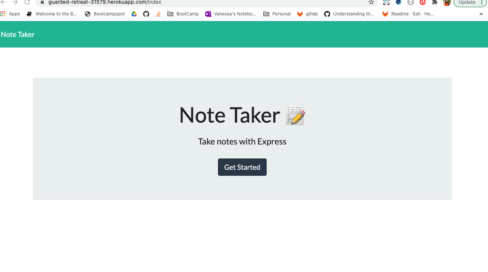
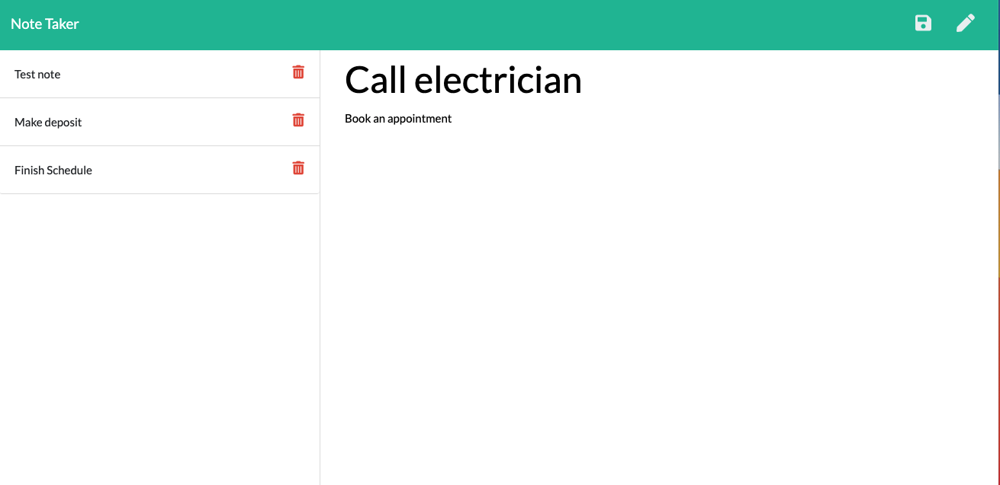

# express_note_taker

Project Name: Express Note Taker

# Description:

For this project I was given the user story of a small business owner interested in an application that would allow the user to write and save notes so that the user can keep thoughts and tasks organized. 

# How to use:

When the application is opened the user is presented with a landing page. When the user clicks the "Get Started" button, the user is redirected to the "notes" page. The user can click on the text field titled "Note Title" to type a note title for the note. The user can then click on the text field titled "Note Text" to write a description of the note. Once the user has typed the note description, the save icon icon will appear at the top of the page. When the user clicks on the save icon, the note is then saved to the left of the page with additional saved notes. When the user wants to remove a note, the user can click on the red trash can icon to remove the note. 

# Screenshot:

# Link to deployed application:

https://guarded-retreat-31579.herokuapp.com/

